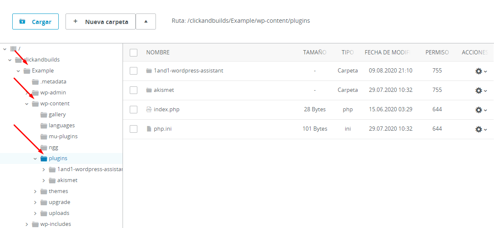
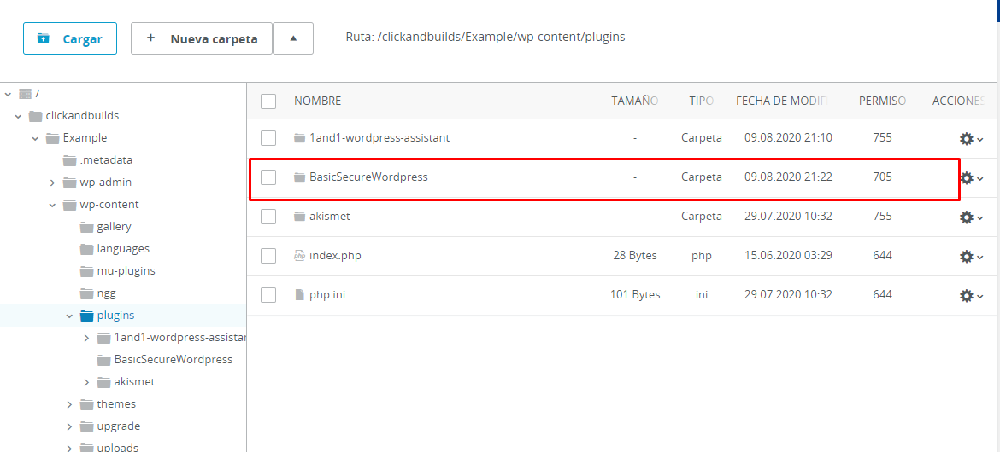
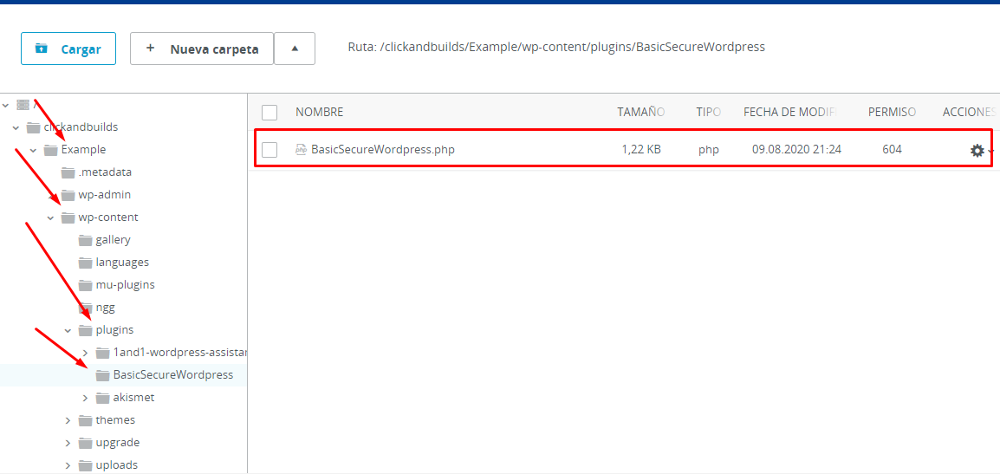
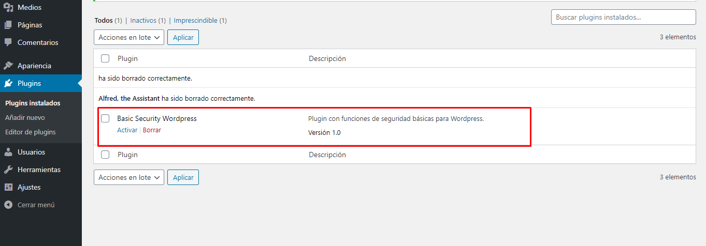
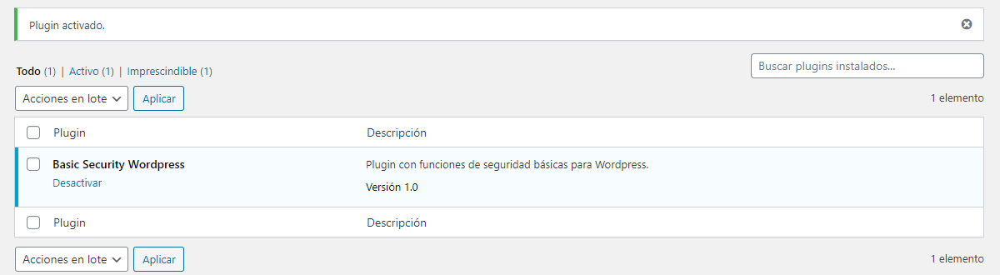

# basicSecureWordpress
 Un plugin de funciones que mejorarán la seguridad de wordpress a nivel básico

# Instalación del plugin

En el administrador de archivos de tu hosting, para este ejemplo usaré uno antiguo que tengo de IONOS, y busca el directorio “plugins”, usualmente está dentro del directorio “wp-content”:

  

Crea una carpeta con el nombre del plugin, en este caso BasicSecureWordpress:

  

Y dentro de este directorio, pega el fichero .php:

  

Luego, ve a tus plugins, actívalo y listo:

  

  

